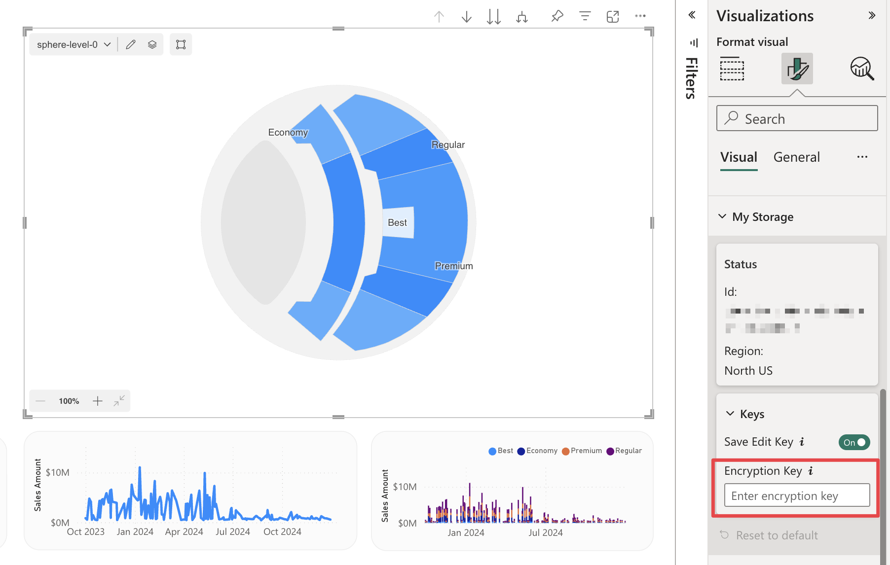

This section contains settings related to the [My Storage](../../features/my-storage.md) keys.

## Save Edit Key

**Default value:** Off

When enabled, the My Storage Edit Key is saved inside the report properties and made available to all report users.

> This setting does not affect whether Power BI can remember the key locally in its cache.

## Encryption Key

**Default value:** (Empty)

Encryption key used to encrypt/decrypt maps on My Storage. This key is required if My Storage was encrypted during the [setup process](../../features/my-storage.md#setup-my-storage). Without this key, it will not be possible to access previously stored maps or upload new maps to My Storage.

Find more information about encryption [here](../../security/my-storage.md#encryption-optional).