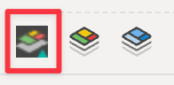
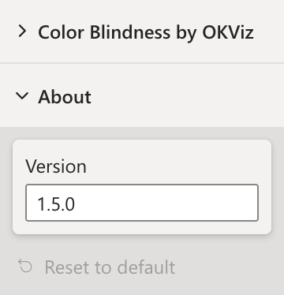
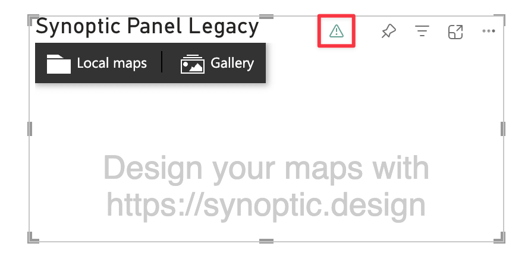
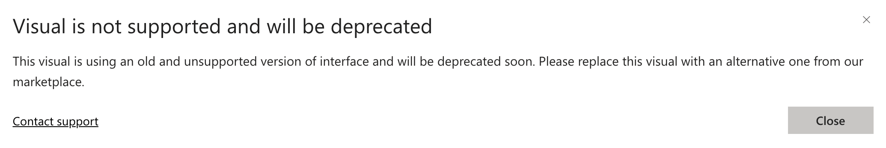

Synoptic Panel v1 is the original version of the visual, which is now deprecated and scheduled for retirement. This version is no longer supported, and we recommend that you upgrade to the latest version of the visual, [Synoptic Panel v2](../versions/index.md).

>> **IMPORTANT**: v1 will stop working on **{{ page.retirement_date }}**.

## Why is v1 Deprecated?
We have rewritten Synoptic Panel from scratch to take advantage of the latest Power BI APIs and to provide a more robust and flexible solution. While **maps created with v1 will continue to work also with v2**, the new version includes new features, options, and improvements that are not compatible in v1. 

By deprecating v1, we can focus on enhancing the new version and providing a better user experience for our customers.

## How to Identify v1
You can determine the version of Synoptic Panel you are using by examining its icon and settings. If you notice the following icon or see version `1.5.0` in the About section, you are using v1.

Also, the visual will display a warning icon with a message indicating that the visual is unsupported. 

> Note: The warning icon is visible only in Power BI Desktop and Power BI Service (powerbi.com) in Editing View when you hover over or select the visual. **If you do not see the warning, it does not necessarily mean you are not using the deprecated version.**

## What Happens Before Retirement

Until the retirement date, which is set for **{{ page.retirement_date }}**, you can continue using Synoptic Panel v1 in your reports. However, the visual will no longer receive updates or support (including security fixes), and we recommend that you upgrade to the latest version of the visual as soon as possible.

## What Happens After Retirement

After the retirement date, which is set for **{{ page.retirement_date }}**, Synoptic Panel v1 will no longer work in your reports and you will see messages indicating that the visual is not available. 

## How to Migrate to v2
To migrate your reports from Synoptic Panel v1 to v2, follow these steps:

1. Go to the links below, choose the appropriate license, and install the visual following the instructions provided:

    - [Synoptic Panel from OKVIZ ](https://okviz.com/synoptic-panel/)
    - [Synoptic Panel from AppSource](https://appsource.microsoft.com/en-us/product/power-bi-visuals/okvizcorp1634637213047.synopticpanelbyokviz-v2)
    - [Synoptic Panel Lite from AppSource](https://appsource.microsoft.com/en-us/product/power-bi-visuals/okvizcorp1634637213047.synopticpanelbyokviz-lite)

    > Note that obtaining the visual from our website or AppSource will result in different licensing models. For more details, refer to the [Licensing page](../licensing.md).

2. Add the new version of Synoptic Panel to your report alongside the old version. Since maps created with v1 are compatible with v2, you can reuse them. However, you will need to reconfigure the visual settings and re-import the maps, as the new version includes several new options and features and cannot be configured in the same way as the old one - **you cannot simply replace the old visual with the new one.**

3. Remove the old version from your report and save the changes.

## Contact Information

If you have any questions or need assistance with the migration process, please contact us at [support@okviz.com](mailto:support@okviz.com?subject=Synoptic%20Panel%20v1%20Migration).
