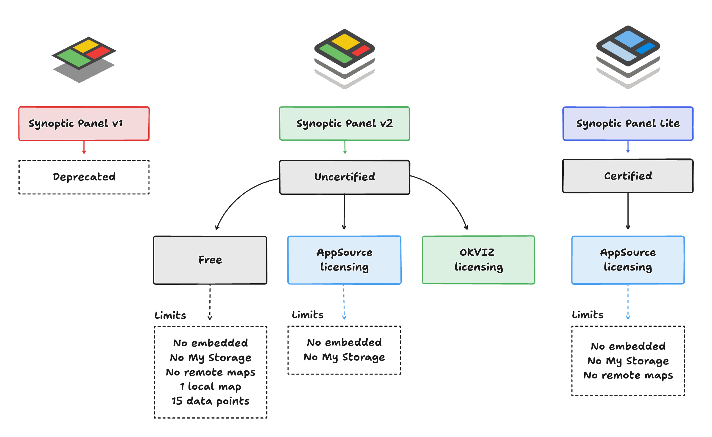

Synoptic Panel is available in three different versions:

- **Synoptic Panel v1**: The original version of the visual, which is now deprecated and scheduled for retirement. For further details, visit the [Deprecated (v1)](./deprecated.md) page.

- **Synoptic Panel v2**: The latest and most advanced version of the visual, which replaces the previous legacy version. This version has been rewritten starting from scratch in 2024 to take advantage of the latest Power BI APIs and to provide a more robust and flexible solution, including new features and improvements.

    This version can be used for free with some limitations, or you can purchase a license to unlock most or all the features. For more information, see the [Licensing page](../licensing.md).

    *Limitations*:

    - **Free**
        - Maximum a single local map per visual.
        - Only the first 15 data points are matched with the map areas, the others are ignored.
        - No Power BI Embedded (Publish To Web, PaaS embed) / Report Server / National Clouds support.
        - No [My Storage](../features/my-storage.md) support.
        - No support for remote maps.

    - **Licensed with AppSource license**
        - No Power BI Embedded (Publish To Web, PaaS embed) / Report Server / National Clouds, since the AppSource licensing model doesn't support these scenarios.
        - No [My Storage](../features/my-storage.md) support.

    - **Licensed with OKVIZ license**
        - No features limitations.

    > [Download and try Synoptic Panel v2](https://okviz.com/synoptic-panel/) from our website.

- **Synoptic Panel Lite**: A simplified version of the v2 that offers a subset of the features available in the full version. **This version is certified by Microsoft** since it doesn't connect to any external service.

    *Limitations*:

    - No Power BI Embedded (Publish To Web, PaaS embed) / Report Server / National Clouds, since the AppSource licensing model doesn't support these scenarios.
    - No [My Storage](../features/my-storage.md) support.
    - No support for remote maps.

    > [Download Synoptic Panel Lite](https://appsource.microsoft.com/en-us/product/power-bi-visuals/okvizcorp1634637213047.synopticpanelbyokviz-lite) from AppSource.

### Features Comparison

Here is a comparison of the features available in each version of Synoptic Panel:

|Version|Certified|Run Embedded|Data Points|Local Maps|Remote Maps|My Storage
|---|---|---|---|---|---|---|
|v2 (OKVIZ)|No|Yes|30K+|Yes|Yes|Yes|
|v2 (AppSource)|No|No|30K+|Yes|No|No|
|v2 (Free)|No|No|15|1|No|No|
|Lite|Yes|No|30K+|Yes|No|No|
|v1|*Deprecated*|
