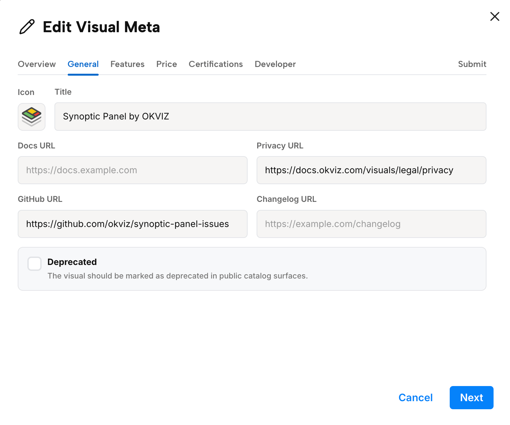
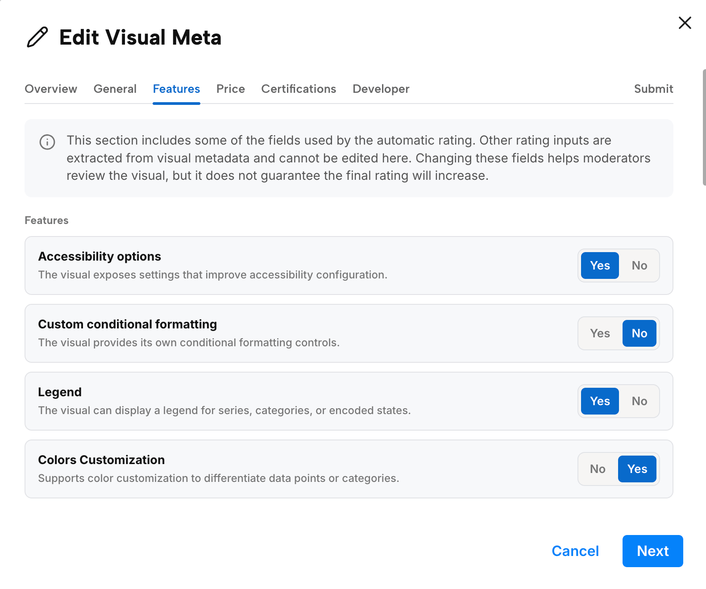
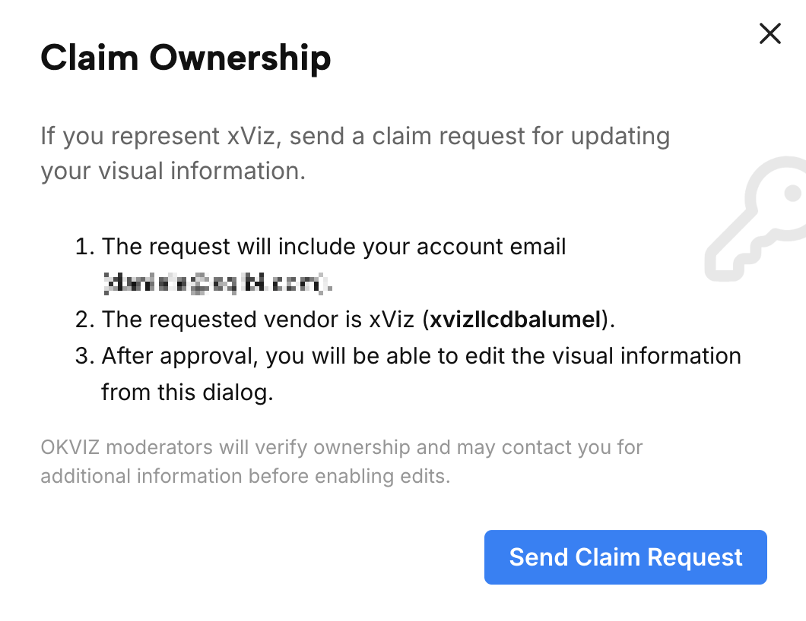

The OKVIZ Index combines public metadata, catalog information, screenshots, linked websites, and AI-assisted analysis to describe and rate Power BI custom visuals. This process improves coverage, but it can still produce incomplete or incorrect information.

**Publishers can claim authority over their visuals and request corrections** when the Index shows inaccurate metadata, missing features, outdated links, or rating inputs that do not match the current public evidence.

## Why Claims Exist

AI helps OKVIZ extract visual features and draft part of the rating assessment. It can review public pages, documentation, screenshots, metadata, and other linked resources faster than a fully manual process.

However, AI-assisted analysis can miss features, misunderstand website content, rely on outdated public pages, or assign the wrong value when evidence is ambiguous. Some visual capabilities are also difficult to verify from public information alone.

The claim process gives publishers a structured way to correct those cases without making the public catalog editable by anyone.

## What Claiming Allows

After a claim is approved, the account can propose edits for visuals associated with the same developer or publisher record. Approval gives editing authority inside the OKVIZ Index; it does not transfer legal ownership, change Microsoft AppSource publisher records, or bypass OKVIZ review.

Depending on the visual, editable areas can include general metadata, public links, features, price information, certifications, and developer information.

Not every property can be edited. OKVIZ can lock or reject changes for values that are already verified from trusted sources, high-confidence metadata, package identity, AppSource identifiers, internal rating weights, or other fields where there is enough certainty.

## How to Request Access

To use the claim and edit workflow:

1. Create or sign in to an OKVIZ account at [auth.okviz.com](https://auth.okviz.com/).
2. Open the visual detail page in the Index.
3. Use the ***Claim*** action to send a claim request for the visual developer.
4. Wait for OKVIZ to review the request.
5. After approval, use ***Edit Visual Meta*** to propose changes for the approved developer's visuals.
6. Submit the proposed changes from the ***Submit*** step.

When possible, use an account email that helps verify your relationship with the publisher, such as a company domain email. OKVIZ may contact you for additional information before enabling edits.

## Review Process

Submitted changes are not applied automatically. OKVIZ reviews each proposed change before it affects public visual metadata, rating inputs, or the public catalog.

During review, OKVIZ may compare the request with AppSource data, public documentation, the publisher website, release notes, screenshots, or other visible evidence. A change can be rejected when it is unsupported, unverifiable, inconsistent with public evidence, or outside the editable scope.

The account that submitted the request receives an email when the claim is accepted or rejected. The account also receives an email when proposed metadata changes are accepted or rejected.

## Effect on the Rating

Correcting visual metadata can affect the rating because the rating depends on features, public support evidence, pricing signals, certification signals, design observations, and other structured inputs.

**An approved correction does not guarantee a higher rating.** Many accepted corrections are expected to improve the rating when they add missing verifiable features or stronger public evidence, but the score can also stay the same if the correction does not affect weighted rating inputs.

If a correction removes an incorrectly assigned feature, confirms a warning, or shows weaker evidence than previously assumed, the rating may not increase.

## Good Correction Requests

Good requests are specific and verifiable. Include public evidence whenever possible, such as documentation pages, changelog entries, AppSource information, pricing pages, support pages, or screenshots that show the current behavior.

Avoid submitting marketing claims that cannot be verified from public evidence. OKVIZ may ask for clarification, but the public Index should remain based on evidence that users can inspect or that OKVIZ can independently verify.
