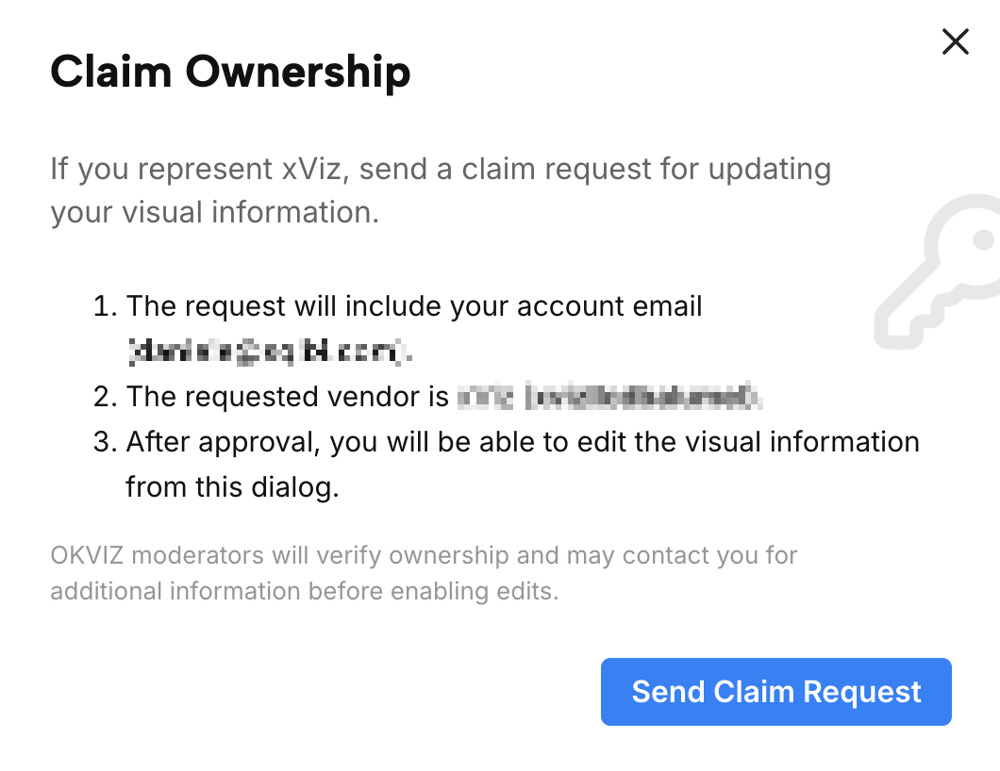
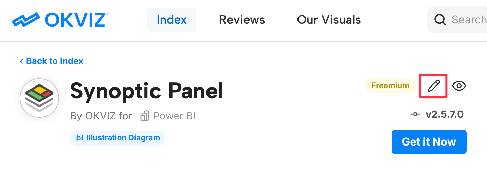
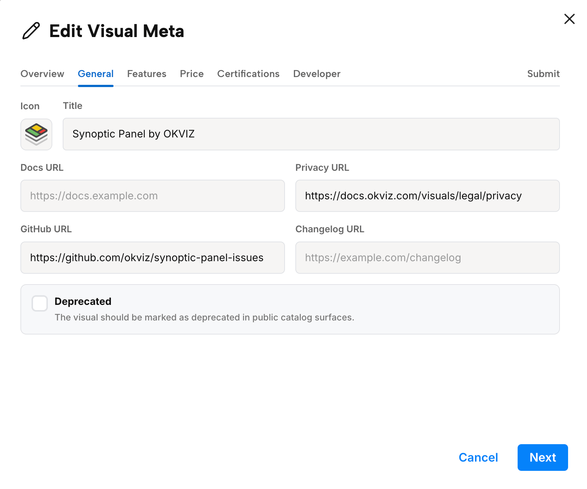
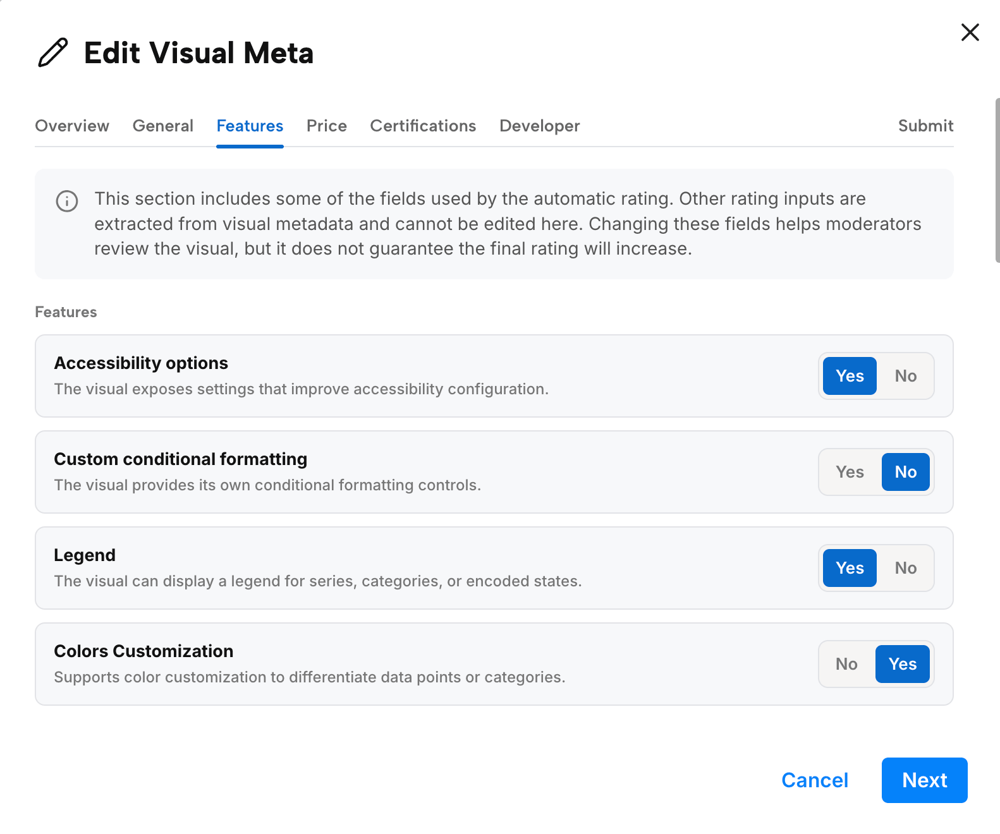

The OKVIZ Index combines public metadata, catalog information, screenshots, linked websites, and AI-assisted analysis to describe and rate Power BI custom visuals. If you represent a visual publisher, **you can claim your visuals and propose corrections** when this information is incomplete, inaccurate, or outdated.

Claims and proposed changes are reviewed by OKVIZ before they affect the public Index. Claiming a visual does not make its public page directly editable.

## Before You Start

Before requesting access:

- Create an OKVIZ account or sign in with your existing account.
- Use a company-domain email address when possible. This helps OKVIZ verify your relationship with the publisher.
- Prepare public evidence for the changes you intend to propose, such as documentation, release notes, AppSource pages, pricing pages, or support pages.

## Request Access to Your Visuals

To request access:

1. Sign in to your OKVIZ account.
2. Open the [OKVIZ Index](https://okviz.com/index/) and find one of your visuals.
3. Open the visual detail page.
4. Select ***Claim***.
5. Verify the account email and publisher shown in the dialog, then select ***Send Claim Request***.

OKVIZ reviews the request and may contact you for more information. The account that submitted the request receives an email when the claim is approved or rejected.

> **NOTE:** Approval grants editing authority inside the OKVIZ Index. It does not transfer legal ownership, change Microsoft AppSource publisher records, or bypass the review of proposed changes.

## Propose a Change

After your claim is approved:

1. Sign in and open the detail page for one of your authorized visuals.
2. Select the ***Edit Visual Meta*** button.

    

3. Change only the fields that need correction.

    

    

4. Review all pending changes in the ***Submit*** step.
5. Submit the proposal for OKVIZ review.

## What You Can Change

Depending on the visual, editable areas can include:

- The visual description and classification.
- Public documentation, website, support, issue, changelog, and purchase links.
- Supported features and other inputs used by the rating.
- Pricing and certification information.
- Developer or publisher information.

Not every property can be edited. OKVIZ can lock values verified from trusted sources, package identity, AppSource identifiers, extracted package metadata, internal rating weights, and other high-confidence fields.

If a field is not editable, explain the requested correction and include its public evidence with the proposal.

## Provide a License When Required

If one or more features included in your proposal require a paid or otherwise restricted license, provide a demo license and/or clear activation instructions, as applicable. Access should remain available long enough for the OKVIZ team to reproduce the feature and complete the review.

Without the required access, the team may be unable to verify the proposed changes. OKVIZ may ask you explicitly for a license or activation details, which can delay the review, or reject the proposal when the claimed functionality cannot be confirmed.

>> **IMPORTANT:** Do not publish license keys, passwords, or other credentials in public evidence or documentation. Provide them only through the private note field in the proposal or directly to OKVIZ.

## Review Process

**Submitted changes are not applied automatically.** OKVIZ reviews each proposed change before it affects public visual metadata, rating inputs, or the public catalog.

During review, OKVIZ may compare the request with AppSource data, public documentation, the publisher website, release notes, screenshots, or other visible evidence. A change can be rejected when it is unsupported, unverifiable, inconsistent with public evidence, or outside the editable scope.

> **NOTE:** The account that submitted the proposal receives an email when the changes are accepted or rejected.

## Effect on the Rating

Correcting visual metadata can affect the rating because the rating depends on features, public support evidence, pricing signals, certification signals, design observations, and other structured inputs.

**An approved correction does not guarantee a higher rating.** Many accepted corrections are expected to improve the rating when they add missing verifiable features or stronger public evidence, but the score can also stay the same if the correction does not affect weighted rating inputs.

If a correction removes an incorrectly assigned feature, confirms a warning, or shows weaker evidence than previously assumed, the rating may not increase.

## Good Correction Requests

Good requests are specific and verifiable. Include public evidence whenever possible, such as documentation pages, changelog entries, AppSource information, pricing pages, support pages, or screenshots that show the current behavior.

Avoid submitting marketing claims that cannot be verified from public evidence. OKVIZ may ask for clarification, but the public Index should remain based on evidence that users can inspect or that OKVIZ can independently verify.
