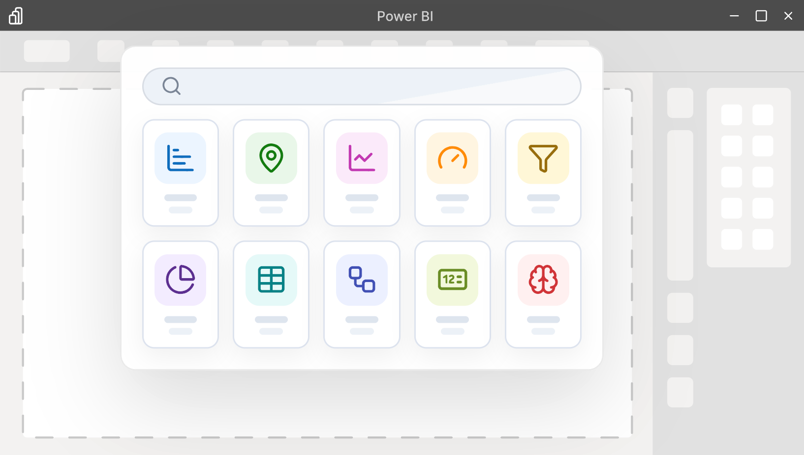

OKVIZ Index is a catalog of Power BI custom visuals designed to help report authors, BI teams, and decision makers compare visuals with more context than a marketplace listing alone can provide.

The Index combines public catalog information, visual metadata, technical signals, screenshots, documentation links, publisher information, and OKVIZ analysis into a searchable experience. The goal is to make discovery faster and more transparent while still encouraging users to validate each visual in their own report scenario.

> You can explore the catalog at [okviz.com/index](https://okviz.com/index).

## What the Index Provides

The Index organizes Power BI visuals by type, category, publisher, rating, release activity, technical capabilities, and other public signals.

It helps answer practical questions such as:

- Which visuals match a specific chart type or reporting need?
- Which publishers provide enough documentation and support evidence?
- Which visuals are free, certified, recently updated, or affected by visible warnings?
- Which visuals deserve closer evaluation before being adopted in a report?

The Index is not intended to replace AppSource, Power BI tenant governance, security review, or hands-on testing. It is a discovery and comparison layer that adds structure around public evidence.

## Philosophy

The OKVIZ Index follows a few principles:

- Evidence is more useful than marketing claims. Public documentation, metadata, screenshots, and visible behavior matter more than generic feature promises.
- Comparisons should be type-aware. A slicer, a map, a table, and a KPI visual should not be judged as if they solved the same problem.
- Ratings should be practical, not absolute. A higher rating means stronger evidence for completeness, design quality, and support, but it does not mean the visual is the best choice for every report.
- Corrections should be possible. Public data can be incomplete or outdated, so publishers can claim visual ownership and request corrections when evidence or assigned values are inaccurate.

## How Data Is Maintained

The Index starts from public catalog data and extracted metadata. Automated processes normalize fields such as visual type, category, publisher, links, pricing model, certification, update information, and technical capabilities.

OKVIZ also uses AI-assisted analysis to improve coverage and consistency for rating details, design assessment, support evidence, and public summaries. AI-assisted output is treated as an assessment, not as unquestioned truth. Quality checks and corrections are applied where evidence is incomplete, inconsistent, or high impact.

See [Index AI Usage](./ai-usage) for details about how AI-assisted processes are used and which machine-readable resources are available for AI tools.

## Rating System

The rating is the most visible summary in the Index. It combines the evidence collected for each visual into a comparable score focused on features, design, and support.

See [Index Rating System](./rating) for the full explanation of how ratings are created, what they measure, and what their limits are.
