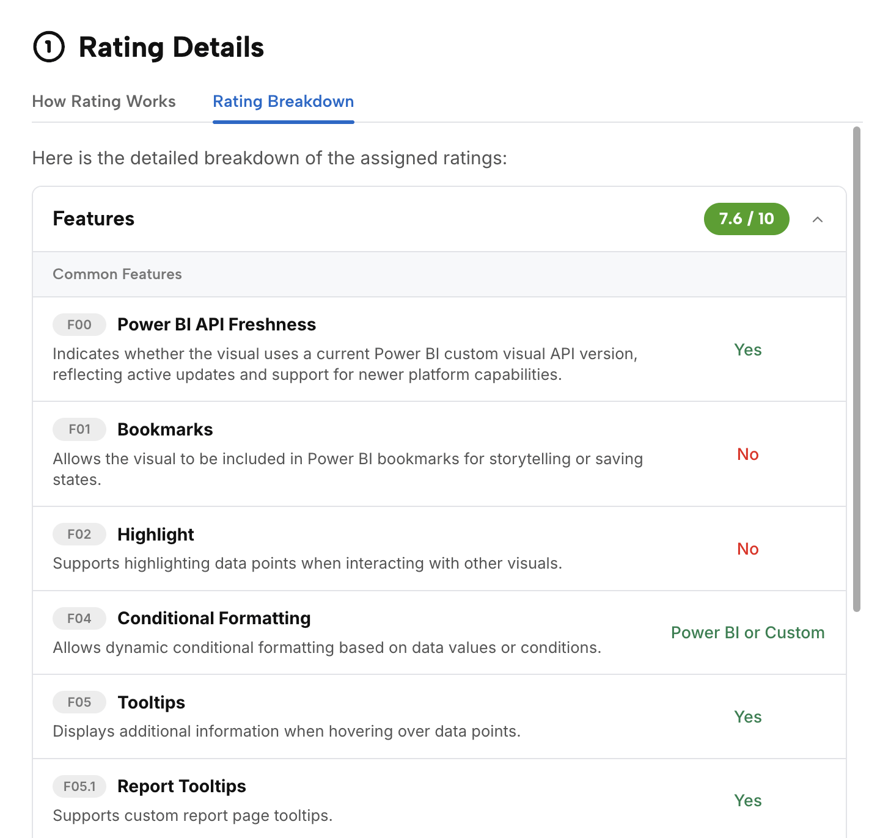

The OKVIZ Index rating is a practical score designed to make Power BI custom visuals easier to compare. It combines public evidence, visual metadata, feature coverage, design quality, support signals, and OKVIZ assessment into a consistent rating.

The rating is not a popularity score, a paid placement, a Microsoft certification, or a guarantee that a visual is suitable for every report. It is a discovery aid that helps users decide which visuals deserve closer evaluation.

## What the Rating Measures

The rating focuses on three main areas: features, design, and support. Each area is evaluated from the evidence available for the visual and from the type or types the visual belongs to.

### Features

Features scoring checks what the visual can do in Power BI and how broadly it supports common report-building needs.

Common feature signals can include tooltips, selection behavior, drilldown, bookmarks, formatting support, accessibility options, Power BI integration behavior, and other capabilities that reduce implementation friction.

Type-specific feature signals depend on the visual classification. A map, a slicer, a table, a matrix, a KPI visual, and a chart visual are evaluated against different expectations because they solve different reporting problems.

### Design

Design scoring evaluates whether the visual communicates data clearly and looks production-ready in business reports.

This includes readability, visual hierarchy, chart-type suitability, formatting quality, interaction patterns, accessibility considerations, and the risk of misleading presentation. Performance and rendering stability can also influence design scoring when there is enough evidence to assess them.

### Support

Support scoring estimates whether users can trust the publisher to maintain, document, and support the visual.

Support signals can include public support links, documentation quality, website quality, release activity, vendor identity, AppSource information, tutorials, examples, bug reporting channels, and warnings for missing, broken, ambiguous, or potentially unsafe evidence.

## How the Score Is Created

The rating is calculated by OKVIZ from a structured process:

1. Public catalog data, package metadata, AppSource links, publisher information, screenshots, technical flags, pricing signals, and known external resources are collected.
2. Structured metadata is normalized into comparable feature, security, pricing, type, category, and lifecycle signals.
3. AI-assisted analysis drafts rating details from normalized evidence and public content. See [Index AI Usage](./ai-usage) for how AI is used in the Index.
4. Quality checks are applied on samples and high-risk cases, especially where evidence is incomplete, vendor identity is ambiguous, or a rating looks inconsistent with visible signals.
5. Public Index lists are ordered by rating inside the active scope.

Deprecated visuals, missing evidence, and visible warnings are handled explicitly instead of silently improving a score.

## Weights and Scoring

Not every criterion has the same importance. Essential capabilities have a greater impact than nice-to-have features, and some criteria matter only for specific visual types.

The final score reflects internal weights applied to the available evidence. This keeps ratings comparable while allowing the model to treat different visual families appropriately.

## Type and Category Scope

The same visual can appear in different public lists, such as ***Top 50***, ***Top Free***, ***Best by Type***, or ***Best by Category***.

The underlying rating method is consistent, but the competing set changes. A visual can therefore appear stronger in one type or category than it does in the overall catalog.

## Limits and Corrections

Ratings are based on public evidence and extracted metadata. Public signals can be incomplete or outdated, especially when publishers do not publish documentation, when AppSource data changes, when screenshots are old, or when a visual has capabilities that are not visible from public sources.

A rating should not be used as a procurement decision by itself. Always validate licensing, certification, privacy, tenant policies, performance, and report requirements before adopting a visual.

Publishers can claim visual ownership from the visual detail page and request corrections when public data or assigned rating values are inaccurate. OKVIZ verifies corrections before updating the public rating, the rating schema, or visual metadata. See [Claim Visual Ownership](./claim-ownership) for details about the claim and review workflow.
