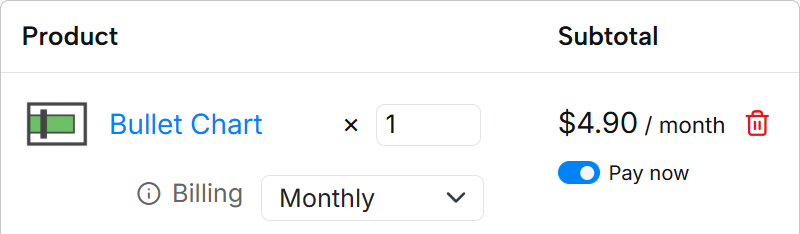

If you create a 1-month free trial license, you can later purchase a license for the same visual without having to create a new order. You can complete the order by entering your [OKVIZ account](https://okviz.com/account/) and selecting the license you want to purchase.

You can create a new order by following the steps below:_

1 - Visit our [OKVIZ website](https://okviz.com/) and select the visual you want to purchase.

2 - Click on the **Try or Purchase** button. 

3 - If you are a returning customer, use the Login link to retrieve your information automatically.

4 - Complete the **Billing Details** section with the information of the person that pays the license for the visual and will receive invoices and receipts for the purchase. This can be a name and company other than who will use the license.

5 - Complete the **Licensee section** with the name and email of the person who will use the visual. For an organization, this could be a group email address. This email will correspond to the account that will be used to manage the license.

6 - Select optional documents if required by your organization.

7 - Complete the **Order Details** section with the information of the license you want to purchase.

  - The **quantity** is 1 by default, but you can change it if you want to purchase multiple licenses. This is useful if you want to buy a Per Capacity or Per Site license, whereas you keep it to 1 when you choose the Per User license type, because you license a tier that includes the total number of users who will design or view reports using the custom visual.

  - **Billing** cycle: Choose the billing cycle for the license. You can select monthly, yearly, or 3-year billing cycle.

  - License **Type**: Choose the type of license you want to purchase. You can Per User (**User**), Per Capacity (**Nodes**), or Per Site (**Embedded**) license type. The following Tier option will adapt to the selected license type.

  - License **Tier**: Choose the tier of the license you want to purchase. The available tiers depend on the selected license type. 
  
8 - Make sure that the **Pay now** checkbox is **checked**. 

9 - Choose the **payment type** (you can read more about the payment methods in the [Payment Methods](./payment-methods.md) page):

  - **Credit and debit cards** are always accepted and can be used for any license amount. The credit card information is securely processed by our payment provider, and we do not store any sensitive payment information on our servers. The credit card will be used for the initial payment and for automatic renewals depending on the billing cycle you selected.

  - **Pay by Invoice / ACH / Wire Transfer** is available for orders over a certain amount. If you select this option, you will receive an invoice with the payment details. You can pay by wire transfer or ACH transfer. The license will be activated once we receive the payment.  If you select this option, you will not be charged automatically at the end of the billing cycle. At every renewal, you will receive an invoice before the expiration date and you can pay by wire transfer or ACH transfer before the license expires. *If this payment option is not available for your order, you can change the billing cycle to obtain an amount over the limit required to enable this payment option.*

10 - **Agree** to the terms and conditions and EULA, and click the **Place Order** button to complete the process and create the order. 
  - If you selected the Credit Card payment option, the payment transaction will start immediately and once completed you immediately receive the license.

  - If you selected the Pay by Invoice / ACH / Wire Transfer payment option, you will receive an invoice with the payment details. The license will be activated once we receive the payment.

After a successful payment, you will receive an email with the license information and a link to download the visual. You can also access the license information from your OKVIZ account. If you did not have an account, one will be created for you automatically. You can access it using the email you provided in the Licensee section.