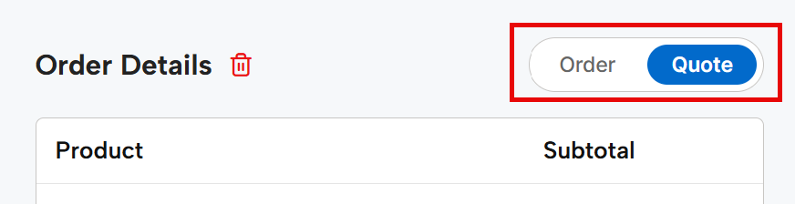
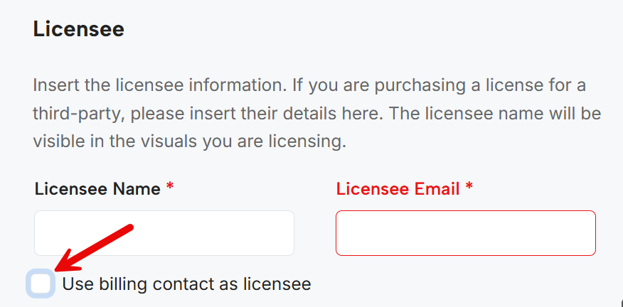

You can create a quote for an OKVIZ custom visual license by following the steps below:_

1) Visit our [OKVIZ website](https://okviz.com/) and select the visual you want to purchase.

2) Click on the **Try or Purchase** button. 

3) If you are a returning customer, use the Login link to retrieve your information automatically.

4) Select the **Quote** switch close to the Order Details section. This will create a quote instead of an order. 

5) Complete the **Billing Details** section with the information of the person/company that receives the quote. This can be a name and company other than who will use the license.

6) Complete the **Licensee section** with the name and email of the person who will use the visual.

  - For a quote, you could skip this information and select the *Use billing contact as a licensee* option. 

  - However, you can save time later by providing the licensee information now, because it will be used in the order that you can create by accepting the quote. Otherwise, you will provide it again when you create the order.

7) Select optional documents if required by your organization.

8) Complete the **Order Details** section with the information for the quote.

  - The **quantity** is 1 by default, but you can change it if you want to quote multiple licenses. This is useful if you want to buy a Per Capacity or Per Site license, whereas you keep it to 1 when you choose the Per User license type, because you license a tier that includes the total number of users who will design or view reports using the custom visual.

  - **Billing** cycle: Choose the billing cycle for the license. You can select monthly, yearly, or 3-year billing cycle.

  - License **Type**: Choose the type of license you want to purchase. You can Per User (**User**), Per Capacity (**Nodes**), or Per Site (**Embedded**) license type. The following Tier option will adapt to the selected license type.

  - License **Tier**: Choose the tier of the license you want to quote. The available tiers depend on the selected license type. 
  
9) **Agree** to the terms and conditions and EULA. The option is not binding for the quote only, because you are not purchasing nor trying any software by simply requesting a quote. We just want to make sure you understand the Terms and Conditions and the EULA for the quote.  

10) Click the **Create Quote** button to complete the process and receive an email with the quote. 

After you complete the quote request, you will receive an email with the quote information. You can also access the quote information from your OKVIZ account. If you did not have an account, one will be created for you automatically. You can access it using the email you provided in the Licensee section.