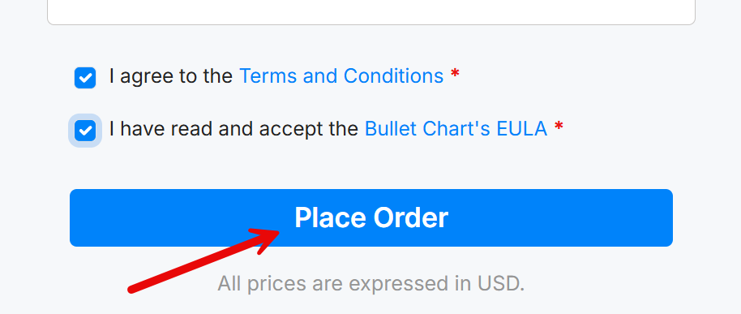

The commercial OKVIZ custom visuals have **1-month free trials available**.  
You must create a license for the free trial, but you do not have to provide any credit card information.

To create a free trial license:

1. Visit our [OKVIZ website](https://okviz.com/) and select the visual you want to try.

2. Click on the ***Try or Purchase*** button. 

    

3. If you are a returning customer, use the Login link to retrieve your information automatically.

4. Complete the ***Billing Details*** section with the information of the person who will buy the visual if the trial is successful. *Please note that if you create a new order later to make the purchase instead of paying after the free trial period, you will create a new license and you will have to replace the visual in your reports.*

5. Complete the ***Licensee*** section with the name and email of the person who will use the visual. For an organization, this could be a group email address. This email will correspond to the account that will be used to manage the license.

6. Select optional documents if required by your organization.

7. Make sure that the ***Pay now*** checkbox is unchecked. This will create a free trial license.  

    

8. You can choose the Billing cycle, license Type, and license Tier if you want. For the trial period, you can leave the default values and change them later if you decide to purchase the license. However, if you provide the information now, the process of license renewal will be simpler if at the end of the trial period you decide to buy the license.

9. Agree to the terms and EULA, and click the ***Place Order*** button to complete the process and create the license. 

    

    > **You are not performing any payment at this stage**, so you will not be charged anything.

After you complete the order, you will receive an email with the license information and a link to download the visual. You can also access the license information from your OKVIZ account. If you did not have an account, one will be created for you automatically. You can access it using the email you provided in the Licensee section.
